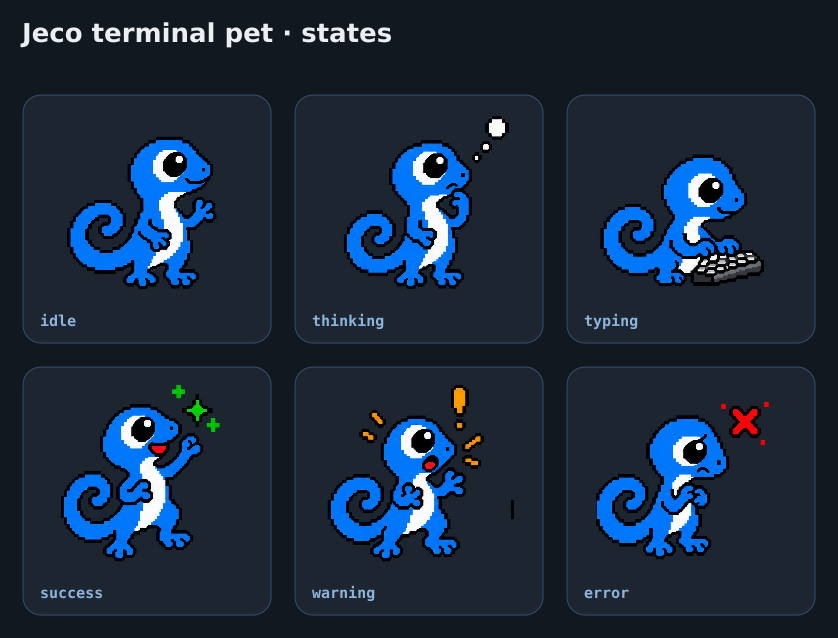

# Jecode brand

Jecode is an owned coding agent for the terminal. Its primary line is:

> **Your code. Your loop.**

Jeco, the steel-blue gecko, is the visual companion. Jeco makes the product
approachable without turning it into a toy: calm expression, curled tail, white
belly, visible hands and feet, and no clothing, robot parts, or detailed scales.

## Voice

Friendly but concise. Lead with results, expose limitations, and avoid hype.
Status language should help the user understand real controller activity rather
than decorate the interface or pretend the product has emotions.

## Core palette

| Role | Value |
|---|---|
| Ink | #12181F |
| Charcoal | #18202A |
| Graphite | #1D2630 |
| Steel | #669BD2 |
| Steel soft | #8DB4DD |
| Technical | #4EC9E8 |
| Foreground | #DCE0E5 |
| Bright | #EBEFF4 |
| Muted | #9CA9B7 |
| Dim | #707C89 |
| Success | #86CB92 |
| Warning | #E6BF5F |
| Danger | #E87070 |

The product interface remains dark Steel. Semantic colors communicate state and
do not recolor the mascot.

## Repository assets

| Asset | Use |
|---|---|
| docs/assets/brand/wordmark-steel.svg | Universal wordmark for README and renderer-neutral surfaces |
| docs/assets/brand/wordmark-dark.svg | Wordmark on light surfaces |
| docs/assets/brand/wordmark-light.svg | Wordmark on dark surfaces |
| docs/assets/brand/jeco-256.png | Standalone mascot |
| docs/assets/brand/app-icon-512.png | Square application or social icon |
| docs/assets/brand/pet-states.png | Reference sheet for functional status poses |
| docs/assets/brand/tokens.json | Machine-readable brand tokens |

The pixel poses are a product direction, not a promise that a terminal pet is
already part of the current release. If introduced, each pose must correspond to
real controller activity and reduced-motion mode must use static state changes.

  

